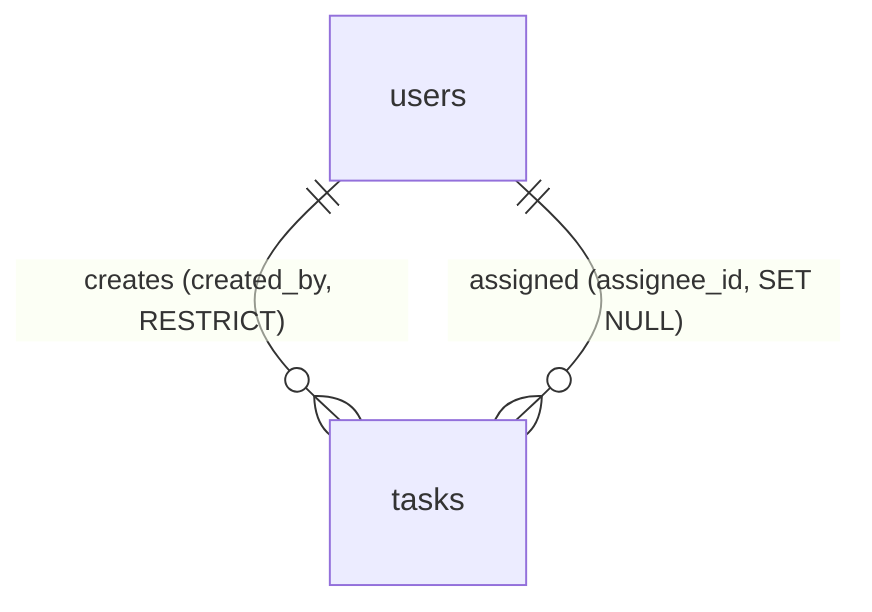

# DATABASE — Mini Jira System

Mô tả này phản ánh **đúng schema Prisma + migrations hiện tại** trong `be/prisma/`.

## 1. Tổng quan

- **Database:** PostgreSQL
- **ORM:** Prisma (schema-first, client type-safe)
- **Vị trí:** `be/prisma/`
  ```text
  be/prisma/
  ├── schema/
  │   ├── schema.prisma   # generator + datasource (postgresql)
  │   ├── user.prisma     # model User
  │   └── task.prisma     # model Task
  ├── migrations/         # migration timestamped (do Prisma sinh)
  └── seeds/              # seed.ts, user.seed.ts, task.seed.ts
  ```
  > Prisma hỗ trợ **schema nhiều file** — model tách riêng `user.prisma` / `task.prisma`.

- **Quy ước đặt tên DB:** bảng `snake_case` số nhiều (`users`, `tasks`); cột `snake_case` (`created_at`, `assignee_id`); cột trong code map sang `camelCase` qua `@map`.

---

## 2. Bảng `users`

| Cột | Type | Ràng buộc |
|-----|------|-----------|
| `id` | UUID | PK, `DEFAULT gen_random_uuid()` |
| `email` | VARCHAR(255) | UNIQUE, NOT NULL |
| `password_hash` | VARCHAR(255) | NOT NULL (bcrypt) |
| `name` | VARCHAR(100) | NOT NULL |
| `avatar_url` | VARCHAR(500) | NULLABLE |
| `created_at` | TIMESTAMP(6) | DEFAULT now() |

## 3. Bảng `tasks`

| Cột | Type | Ràng buộc |
|-----|------|-----------|
| `id` | UUID | PK, `DEFAULT gen_random_uuid()` |
| `title` | VARCHAR(200) | NOT NULL |
| `description` | TEXT | NULLABLE |
| `priority` | VARCHAR(20) | NOT NULL, CHECK IN (`low`,`medium`,`high`,`critical`) |
| `status` | VARCHAR(20) | NOT NULL, DEFAULT `backlog`, CHECK IN (`backlog`,`todo`,`in-progress`,`done`) |
| `position` | INTEGER | NOT NULL, DEFAULT 0 — thứ tự trong cột |
| `assignee_id` | UUID | FK → `users(id)`, NULLABLE, `ON DELETE SET NULL` |
| `created_by` | UUID | FK → `users(id)`, NOT NULL, `ON DELETE RESTRICT` |
| `due_date` | DATE | NULLABLE |
| `created_at` | TIMESTAMP(6) | DEFAULT now() |
| `updated_at` | TIMESTAMP(6) | `@updatedAt` (Prisma tự cập nhật) |

> **Lưu ý quan trọng:** `priority`/`status` là **VARCHAR(20) + CHECK constraint** ở DB, **không phải** Prisma `enum`. Bản init dùng PG enum nhưng migration `use_task_status_priority_checks` đã chuyển sang VARCHAR + CHECK. Giá trị `status` lưu dạng có gạch nối: **`in-progress`** (khớp Zod enum trong `@jiramini/shared`).

---

## 4. Quan hệ



- Một user tạo nhiều task (`created_by`, bắt buộc).
- Một user được giao nhiều task (`assignee_id`, nullable).

## 5. Index

```text
idx_tasks_status      ON tasks(status)
idx_tasks_assignee    ON tasks(assignee_id)
idx_tasks_priority    ON tasks(priority)
idx_tasks_due_date    ON tasks(due_date)
users_email_key       UNIQUE ON users(email)
```

## 6. Quy ước

| Quy ước | Áp dụng |
|---------|---------|
| Khoá chính | UUID `@default(dbgenerated("gen_random_uuid()")) @db.Uuid` |
| Soft delete | Không dùng — hard delete (FE có ConfirmDialog) |
| Timestamps | `created_at` DEFAULT now(); `updated_at` qua `@updatedAt` |
| Enum giá trị | VARCHAR + CHECK constraint (không dùng PG enum) |

## 7. Migrations & Seed

- **Tool:** `prisma migrate dev` (dev), `prisma migrate deploy` (prod — script `db:deploy`).
- **Generate client:** `npm run db:generate` (`prisma generate`).
- **Seed:** `npm run seed` (`prisma db seed` → `prisma/seeds/seed.ts`).
- Migration auto-sinh trong `prisma/migrations/` — không sửa tay; rollback bằng cách viết migration mới.
- Quy trình: sửa file trong `prisma/schema/` → `npx prisma migrate dev --name <change>` → commit cả schema lẫn migration.

## 8. Prisma schema (rút gọn)

```prisma
// schema/schema.prisma
datasource db { provider = "postgresql"  url = env("DATABASE_URL") }
generator client { provider = "prisma-client-js" }

// schema/task.prisma
model Task {
  id          String  @id @default(dbgenerated("gen_random_uuid()")) @db.Uuid
  title       String  @db.VarChar(200)
  description String? @db.Text
  priority    String  @db.VarChar(20)            // CHECK in (low,medium,high,critical)
  status      String  @default("backlog") @db.VarChar(20) // CHECK in (backlog,todo,in-progress,done)
  position    Int     @default(0)
  assigneeId  String? @map("assignee_id") @db.Uuid
  createdBy   String  @map("created_by") @db.Uuid
  dueDate     DateTime? @map("due_date") @db.Date
  createdAt   DateTime  @default(now()) @map("created_at") @db.Timestamp(6)
  updatedAt   DateTime  @default(now()) @updatedAt @map("updated_at") @db.Timestamp(6)
  assignee    User? @relation("TaskAssignee", fields: [assigneeId], references: [id])
  creator     User  @relation("TaskCreator",  fields: [createdBy],  references: [id])
  @@index([status], map: "idx_tasks_status")
  @@index([assigneeId], map: "idx_tasks_assignee")
  @@index([priority], map: "idx_tasks_priority")
  @@index([dueDate], map: "idx_tasks_due_date")
  @@map("tasks")
}
```
